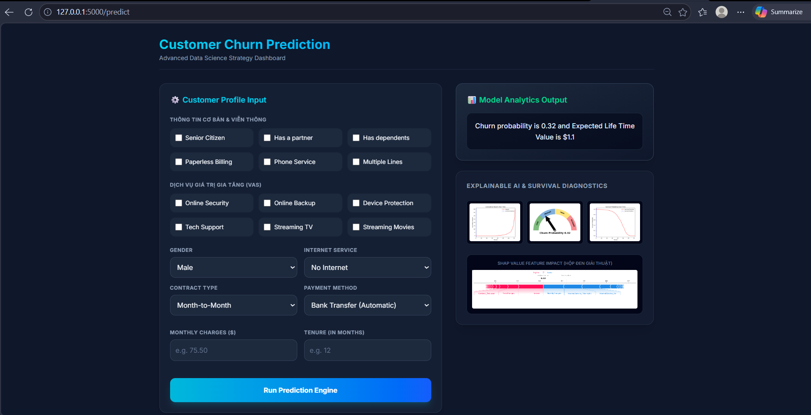

# Customer Churn Prediction & Survival Analytics System

An end-to-end machine learning system to predict customer churn probability, analyze customer retention behavior, and estimate Customer Lifetime Value (CLTV) using churn prediction and survival analysis techniques.

## 📸 App Demo

<p align="center">
    
</p>

---

## 📁 Project Structure

```
.
├── Images/                             : Contains visualization images
├── static/images/                      : Plots for Flask App (gauge, survival, hazard, shap)
├── templates/index.html                : HTML template for Flask App
├── 01_Exploratory_Data_Analysis.ipynb  : Data analysis and understanding customer behavior
├── 02_Churn_Prediction_Model.ipynb     : Random Forest model to predict customer churn
├── 03_Customer_Survival_Analysis.ipynb : Kaplan-Meier, Log-rank test, Cox Proportional Hazard model
├── app.py                              : Flask Web Application
├── model.pkl                           : Trained Random Forest model
├── explainer.bz2                       : SHAP Explainer
├── requirements.txt                    : Required dependencies
├── LICENSE.md                          : MIT License
└── README.md                           : Project documentation
```

---

## 🔍 Customer Survival Analysis

**Objective:** Understand how and when customers churn over time using survival analysis methods.

**Methods used:**
- **Kaplan-Meier Survival Curve** — visualizes survival probability over time
- **Log-Rank Test** — compares churn probabilities across customer groups (gender, contract type, internet service, etc.)
- **Cox Proportional Hazard Model** — models the relationship between customer characteristics and churn risk

**Key findings:**
- Customers with month-to-month contracts churn significantly faster than those on long-term contracts
- Customers enrolled in services like online security and tech support have higher survival probability
- Automatic payment methods correlate with lower churn rates
- Fiber optic internet service users show higher churn compared to DSL users

---

## 📊 Customer Churn Prediction

**Model:** Random Forest Classifier with class weighting (1:3) to handle class imbalance

**Pipeline:**
- Exploratory Data Analysis (EDA) and feature engineering
- Hyperparameter tuning via Grid Search Cross Validation
- Train/test split: 80% / 20%

**Results:**
- F1 Score: **0.62**
- ROC-AUC: **0.85**

**Explainability:**
- **Permutation Importance** — identifies most impactful features
- **Partial Dependence Plots** — shows how churn probability changes across feature ranges
- **SHAP Values** — explains individual customer predictions

---

## 💰 Customer Lifetime Value (CLTV)

CLTV is calculated by multiplying the customer's monthly charges by their expected lifetime, derived from the Cox survival function. A customer is considered churned when their survival probability drops below 10%.

---

## 🚀 How to Run

```bash
pip install -r requirements.txt
python app.py
```

Then open `http://localhost:5000` in your browser.

---

## 🛠️ Technologies

Python, Pandas, NumPy, Scikit-learn, Lifelines, SHAP, Matplotlib, Flask, HTML/CSS

---

## 📄 License

MIT License
